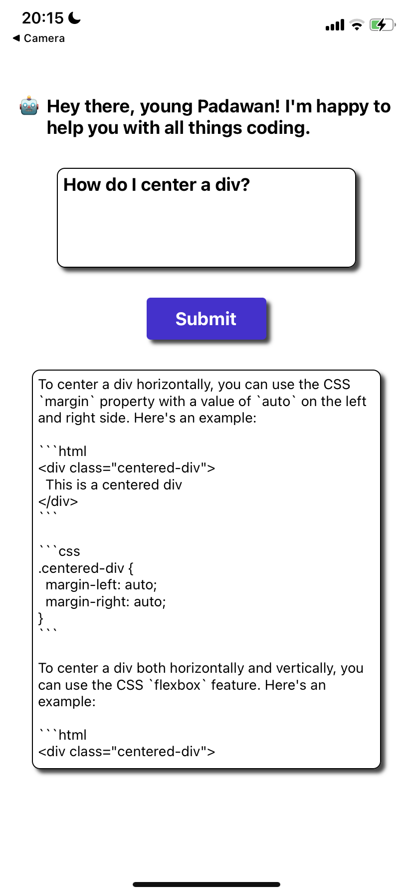

<a name="readme-top"></a>

# Code Jedi 🫳🏽✨

  <p align="left">
   ✨ Code Jedi ✨ is a ChatGPT integrated mobile app, which allows users to ask coding related questions to GPT 3.5 Turbo, through a mobile interface. This project was my first experience with React Native and it is the first mobile app, I have ever built. 
   
  </p>
</div>

## About The Project

This is how the UI looks like on the mobile app:
<br/>
<br/>


<p align="right">(<a href="#readme-top">back to top</a>)</p>

### Built With 🛠️

[](https://reactnative.dev/)

<p align="right">(<a href="#readme-top">back to top</a>)</p>

## Running the App locally 🚀

In order to run this app on your local smartphone, install React Native, clone the repository and use Expo, to access the app on your phone. To connect a GPT model to the app, you will have to get an API key for the OpenAI API.

Follow these steps:

### 1. Prerequisites

- Ensure you have [Node.js](https://nodejs.org/) installed.
- Install the React Native CLI:

  ```bash
  npm install -g react-native-cli
  ```

  <br/>

- Install Expo CLI:
  ```bash
  npm install -g expo-cli
  ```

### 2. Clone the Repository

git clone [URL_OF_YOUR_REPOSITORY]
cd [REPOSITORY_NAME]

### 3. Install NPM packages

```sh
npm install
```

### 4. Setup the OpenAI API Key:

- Create an account or login to OpenAI.
- Get your API key from the OpenAI dashboard.
- Create a secrets.js file in the root of the project and add the following:

```javascript
export const apiKey = "[YOUR_OPENAI_API_KEY]";
```

Replace [YOUR_OPENAI_API_KEY] with the actual API key.

<p align="right">(<a href="#readme-top">back to top</a>)</p>

## Contributing

Your contributions are always welcome! If you have improvements, features, or bug fixes to suggest, please follow the steps below:

1. Fork the Project: Click on the 'Fork' button at the top right of this repo.
2. Clone Your Fork: Clone your forked repository to your local machine.

```bash
git clone https://github.com/max-von-aigner/code_jedi.git
```

3. Create a New Branch: Navigate to the project directory and create a new branch for your feature or fix.

```bash
cd YOUR_REPOSITORY_NAME
git checkout -b feature/YourFeatureName
```

4. Make Your Changes: Add or edit files in your feature branch. (`git push origin feature/AmazingFeature`)
5. Commit Your Changes: Once you've made changes, commit them.

```bash
git commit -m 'Describe your changes here'
```

6. Push to Your Branch: Push your committed changes to your branch on GitHub.

```bash
git push origin feature/YourFeatureName
```

7. Open a Pull Request: Return to this repository, navigate to the 'Pull Requests' tab, and click on 'New Pull Request'. Select your fork and the branch you created.

8. Describe Your Changes: Provide a clear title and description for your pull request to help maintainers understand and review your contribution.

### Feedback and Issues

If you simply want to suggest a change or report a bug, please open a new issue in this repository with the appropriate label (e.g., "enhancement" or "bug").

### Support This Project

If you find this project helpful, consider giving it a ⭐ on GitHub!

<p align="right">(<a href="#readme-top">back to top</a>)</p>

## Contact

Max von Aigner - von.aigner@gmail.com

[![LinkedIn][linkedin-shield]][linkedin-url]
<br/>
[](https://twitter.com/MaxVonAigner)

## Project Link

For more details or to view the full project repository, visit the link below:

[https://github.com/max-von-aigner/code_jedi](https://github.com/max-von-aigner/code_jedi)

<p align="right">(<a href="#readme-top">back to top</a>)</p>

[linkedin-shield]: https://img.shields.io/badge/-LinkedIn-black.svg?style=for-the-badge&logo=linkedin&colorB=555
[linkedin-url]: https://linkedin.com/in/von_aigner
[product-screenshot]: images/demo-img.png
